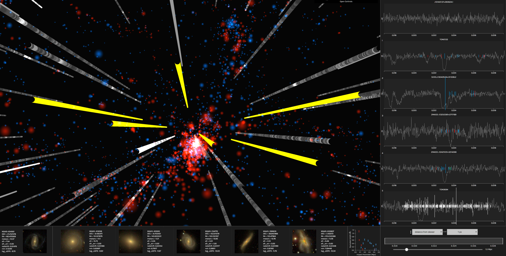
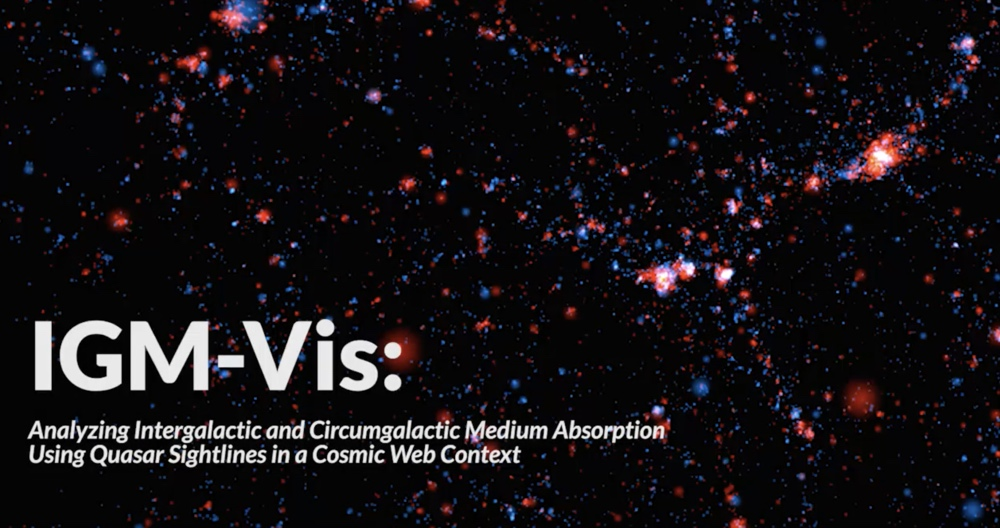
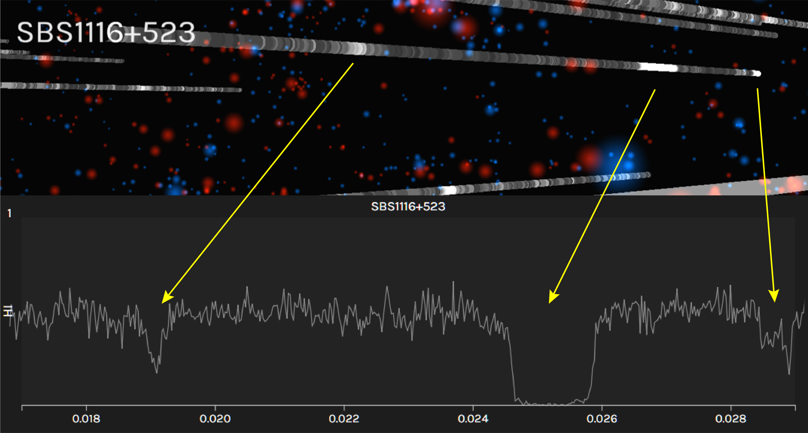

# IGM-Vis: Analyzing Intergalactic and Circumgalactic Medium Absorption Using Quasar Sightlines in a Cosmic Web Context

The Intergalactic Media Visualization, or IGM-Vis, is a novel visualization and data analysis platform for investigating galaxies and the gas that surrounds them in context with their larger scale environment, the Cosmic Web.  Environment is an important factor in the evolution of galaxies from actively forming stars to a quiescent state with little, if any, discernible star formation activity. The gaseous halos of galaxies (the circumgalactic medium, or CGM) play a critical role in their evolution, because the gas necessary to fuel star formation and any gas expelled from widely observed galactic winds must encounter this interface region between galaxies and the intergalactic medium (IGM). 

The blue and red spheres represent star-forming and quiescent galaxies, respectively, and the
'skewers' piercing the volume are QSO sightlines. Mouse over a galaxy to see an image and a few
of its properties in the lower panel.  Mouse over a skewer and the right-hand panels show the spectral region where H I or C IV (or other available sperctra) fall within a specified redshift range.  If a galaxy has an impact parameter within the range indicated by the bottom-right slider, a
vertical line will appear at its redshift in the spectral window.  Use the two drop-down boxes to
control the height and thickness of these lines according to different properties.  Lastly, control
the range of redshift shown in the spectral windows with the sizing bar between the drop-downs and
the slider.

Galaxy/absorber pairs can be tracked using the numeric keys '0' through '9' (skghtlines) and 'G' (galaxies), and then saved to disk for further analysis by pressing 'D'. 

## Video Documentation

A video tutorial with an example use case can be seen here: [https://www.youtube.com/watch?v=3ZVaExEVZOk](https://www.youtube.com/watch?v=3ZVaExEVZOk)

## Web Demo

The Web demo of IGM-Vis is located at: [https://creativecodinglab.github.io/Intergalactic/intergalactic.html](https://creativecodinglab.github.io/Intergalactic/intergalactic.html) 

## Quick Reference 
Arrow keys: move reference point (in 3D view)  
0 - 9 : store selected skewer to Spectrum Panel 
E : obtain equivalent width measurements (see video tutorial)  
G : store selected galaxy in Galaxy Panel 
D : download json file of all stored skewers with galaxy neighbor pairs 
S : show / hide skewers in 3D view   
T : show / hide text in 3D view   
Z : zoom camera to selected galaxy in 3D view  

## Screenshots of IGM-Vis

## Data Processing

Galaxies positions and metadata are loaded from `data/galaxies.json` file using the `loadGalaxyData()` function. Once this file has been read, the function `loadSkewerData()` is called and reads the list of QSOs `qsosInSdssSlice_viz.dat` for their name, Right Ascension (RA) and Declination (DEC). The HI and CIV spectra for each QSO listed in `qsosInSdssSlice_viz.dat` is loaded from these folders respectively:  `data/spectra_HI_norm` and `data/spectra_CIV_norm`. Calculating the projected distance between every skewer and galaxy can be done using the function `computeProjections()`, which uses the `haversine()` function to calculate an angular distance (impact parameter) between the two objects. In order to do this calculation, redshift must converted to physical units, which is done with the `cosmcalc()` function. In order to save time, a lookup table stored in `data/projections/lookUp.json` is referenced, which was created using the `cosmcalc()` function. If values outside of the range contained in the lookup table are needed, the computation is done on demand. In order to quicken the initial loading time even further, the impact parameter values for this dataset were precomputed in Megaparsecs using the steps outlined above and are stored in the folder `data/projections` as a separate file for each quasar with the function `loadP()`. Data can be downloaded into a .json file using the function `exportData('example.json',JSON.stringify([an array]))`. The data object that is downloaded on the "D" key press can be modified in the `onKeyDown(event)` event handler.

## Authors

IGM-Vis was created by an interdisciplinary team of researchers at University of California, Santa Cruz.

- Dept. of Astronomy & Astrophysics: Joseph N. Burchett, J. X. Prochaska;
- Dept. of Computational Media: David Abramov, Cassia Artanegara, Jasmine Otto, and Angus G. Forbes

An article describing IGM-Vis is accepted to EuroVis’19, and a pre-print is available on ArXiv at https://arxiv.org/abs/1812.07092

